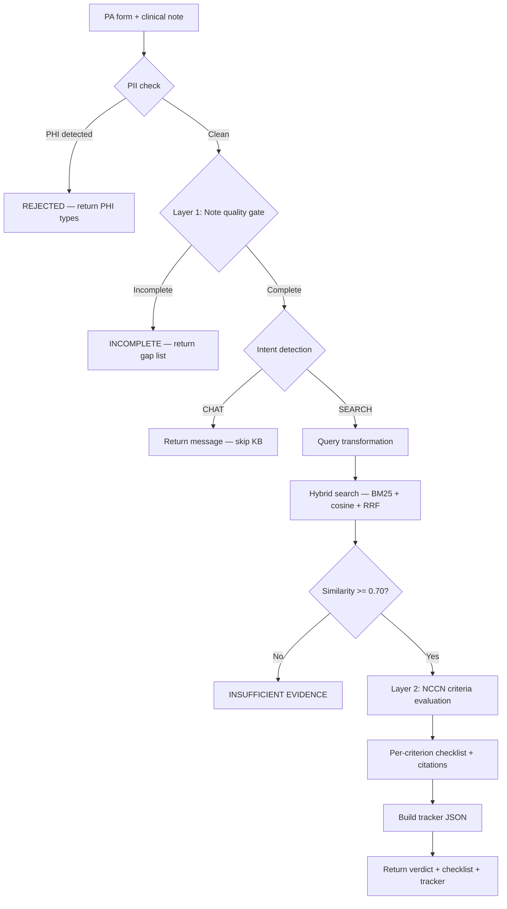

# prior-auth-rag

**Oncology Prior Authorization RAG Pipeline**

A two-layer retrieval-augmented generation pipeline that automates
clinical note quality review and NCCN guideline evaluation for oncology
prior authorization decisions.

---

## What this system is

This is not a chatbot. It is a deterministic clinical decision support
pipeline where a PA submission goes in and a criterion-by-criterion
authorization verdict — grounded in retrieved NCCN guideline text —
comes out.

**Layer 1 — Note quality gate:** Checks the clinical note for five
required elements before any guideline retrieval begins. Returns the
exact gap list if incomplete. Stops the pipeline. No wasted LLM calls
on a submission that will be denied for missing documentation.

**Layer 2 — NCCN criteria evaluation:** Retrieves the relevant NCCN
guideline sections and evaluates each PA criterion against the patient's
clinical data. Returns a per-criterion checklist with citations, an
evidence level (Category 1, 2A, etc.), and a structured tracker JSON.

---

## The problem it addresses

- 85% of oncologists report PA requirements delay cancer treatment
- 41% of immunotherapy PA requests are denied on first submission
- 73% of those denials are overturned on appeal
- The majority of denials are documentation failures — the clinical
  indication existed, but the note was missing required elements or
  mismatched against payer criteria

The 73% overturn rate is the key statistic. It means most denials are
not clinical rejections — they are administrative failures that this
pipeline catches before submission.

---

## Demo scenario

```
Patient:     62-year-old male
Diagnosis:   Non-small cell lung cancer, adenocarcinoma, stage IIIA
ICD-10:      C34.12
PD-L1 TPS:   60% (Dako 22C3 pharmDx assay)
EGFR:        Negative (exon 19 del, exon 21 L858R, exon 20 ins)
ALK:         Negative by IHC D5F3
ROS1:        Negative by FISH
ECOG PS:     1
Line:        First-line, treatment naive
Request:     Pembrolizumab (Keytruda) 200mg IV Q3W monotherapy
```

Expected output: **APPROVED — NCCN Category 1 (Preferred)**

Seven criteria evaluated. All met. Citations to NCCN NSCLC v5.2026
and KEYNOTE-024 trial data on every criterion.

---

## Pipeline flow



---

## Project structure

```
prior-auth-rag/
├── data/
│   ├── pdfs/                           ← knowledge base PDFs (gitignored)
│   │   ├── nccn_nsclc_2025.pdf         ← NCCN NSCLC v5.2026 (302 pages, 847 chunks)
│   │   ├── pembrolizumab_fda_label.pdf ← Keytruda FDA label (133 pages, 292 chunks)
│   │   └── cigna_oncology_policy.pdf   ← Cigna Policy 1403 (51 pages, 91 chunks)
│   ├── test_notes/                     ← six clinical test scenarios
│   └── prior_auth_rag.db               ← SQLite vector store (gitignored)
├── docs/                               ← technical and clinical documentation
│   ├── 01_system_architecture.md
│   ├── 02_knowledge_base.md
│   ├── 03_retrieval_deep_dive.md
│   ├── 04_clinical_workflows.md
│   ├── 05_enterprise_architecture.md
│   ├── 06_failure_modes_and_scaling.md
│   ├── 07_clinical_domain.md
│   └── 08_cost_and_infrastructure.md
├── server/
│   └── main.py       ← FastAPI: /health, /ingest, /authorize
├── frontend/
│   └── app.py        ← Streamlit PA form and verdict display
├── ingest.py         ← PDF extraction, chunking, embedding, SQLite storage
├── retrieval.py      ← BM25 + cosine similarity + RRF + threshold check
├── generate.py       ← PII check, intent, query transform, Layer 1, Layer 2
├── pipeline.py       ← pipeline orchestration utilities
└── requirements.txt
```

---

## Knowledge base

Three documents, 486 pages, 1,230 chunks:

| Document | Source | Pages | Chunks | What it answers |
|---|---|---|---|---|
| NCCN NSCLC v5.2026 | nccn.org (free registration) | 302 | 847 | Clinical criteria — Category 1 evidence, PD-L1 thresholds, KEYNOTE data |
| Pembrolizumab FDA label | accessdata.fda.gov (direct PDF) | 133 | 292 | Regulatory criteria — approved indication language, dosing |
| Cigna Policy 1403 | static.cigna.com (public) | 51 | 91 | Payer criteria — documentation requirements, coverage conditions |

PDFs are not committed to the repository (licensing and file size).
Download instructions and direct URLs are in `docs/02_knowledge_base.md`.

---

## API endpoints

### GET /health
```json
{"status": "healthy"}
```

### POST /ingest
Upload PDF files for ingestion. Files are saved to `data/pdfs/` and
processed immediately.

```bash
curl -X POST http://localhost:8000/ingest \
  -F "files=@nccn_nsclc_2025.pdf"
```

Response:
```json
{
  "ingested": [
    {
      "filename": "nccn_nsclc_2025.pdf",
      "status": "success",
      "pages": 302,
      "chunks": 847
    }
  ]
}
```

### POST /authorize
Submit a PA request. Full field list: `age`, `sex`, `ecog`, `dx`,
`icd`, `stage`, `hist`, `pdl1`, `egfr`, `alk`, `ros1`, `agent`,
`line`, `regimen`, `prior`, `note`.

**Response — Layer 1 incomplete:**
```json
{
  "layer1_status": "INCOMPLETE",
  "gaps": ["ECOG performance status not documented"],
  "layer2_status": "BLOCKED",
  "verdict": null,
  "tracker": { "layer1_note_quality": "FAIL", "layer1_gaps": [...] }
}
```

**Response — PHI detected:**
```json
{
  "layer1_status": "REJECTED",
  "message": "Submission rejected: PHI detected. Found: Patient full names, SSN.",
  "layer2_status": "BLOCKED"
}
```

**Response — approved:**
```json
{
  "layer1_status": "PASS",
  "layer2_status": "APPROVED",
  "verdict": {
    "verdict": "APPROVED",
    "evidence_level": "Category 1 (Preferred)",
    "criteria_checklist": [
      {
        "criterion": "PD-L1 TPS >= 50% (Dako 22C3 assay)",
        "met": true,
        "rationale": "PD-L1 TPS 60% exceeds the >= 50% threshold",
        "source": "NCCN NSCLC v5.2026, p. MS-36; KEYNOTE-024"
      }
    ],
    "overall_rationale": "...",
    "appeal_recommended": false
  },
  "tracker": { "patient_id": "PA-47136", "layer2_verdict": "APPROVED", ... }
}
```

---

## How to run

### Prerequisites

- Python 3.10+
- Mistral AI API key — https://console.mistral.ai/
- NCCN account for guideline download — https://nccn.org

### Setup

```bash
git clone https://github.com/RaagaLikhithaM/prior-auth-rag
cd prior-auth-rag

# Windows
python -m venv venv
venv\Scripts\Activate.ps1

# macOS / Linux
python -m venv venv
source venv/bin/activate

pip install -r requirements.txt
```

Create `.env` in the project root:
```
MISTRAL_API_KEY=your_key_here
```

### Download PDFs

Download the three knowledge base documents and place them in
`data/pdfs/`:

| File | Source | URL |
|---|---|---|
| `nccn_nsclc_2025.pdf` | NCCN (free account) | https://nccn.org → Guidelines → Non-Small Cell Lung Cancer |
| `pembrolizumab_fda_label.pdf` | FDA | https://www.accessdata.fda.gov/drugsatfda_docs/label/2023/125514s103lbl.pdf |
| `cigna_oncology_policy.pdf` | Cigna | https://static.cigna.com/assets/chcp/pdf/coveragePolicies/pharmacy/ph_1403_coveragepositioncriteria_oncology.pdf |

### Ingest PDFs

```bash
python ingest.py
```

Takes 10-15 minutes on first run. Expected output:

```
Found 3 PDFs to ingest:
  - nccn_nsclc_2025.pdf
  - pembrolizumab_fda_label.pdf
  - cigna_oncology_policy.pdf
Ingesting: nccn_nsclc_2025.pdf
  Status: success  Pages: 302  Chunks: 847
Ingesting: pembrolizumab_fda_label.pdf
  Status: success  Pages: 133  Chunks: 292
Ingesting: cigna_oncology_policy.pdf
  Status: success  Pages: 51   Chunks: 91
Ingestion complete.
Database saved to: data/prior_auth_rag.db
```

### Run the system

Open two terminals:

```bash
# Terminal 1 — FastAPI server (no --reload, Python 3.14 compatibility)
uvicorn server.main:app --port 8000

# Terminal 2 — Streamlit frontend
streamlit run frontend/app.py
```

Open browser at `http://localhost:8501`. The form is pre-filled with
the demo scenario. Click "Run prior authorization pipeline."

---

## Chunking considerations

**Chunk size: 512 tokens with 50-token overlap**

512 tokens is approximately 1-2 clinical paragraphs — large enough to
contain a complete NCCN recommendation with its qualifying conditions,
small enough that the embedding reflects a coherent clinical topic.

The 50-token overlap ensures criteria that span chunk boundaries appear
complete in at least one chunk. NCCN recommendation statements
frequently qualify across paragraph breaks ("pembrolizumab monotherapy
is recommended... for patients without sensitizing EGFR mutations
or ALK/ROS1 rearrangements...") — both halves must be retrievable.

**Why tiktoken `cl100k_base` over character splitting:**
This is the same encoding the Mistral API uses internally. Character
splitting produces chunks of unpredictable token length — a 2,000-
character chunk of dense clinical abbreviations might be 650 tokens
(exceeds some model operation limits) or 380 tokens. Token-based
chunking guarantees every chunk is within the model's context window
and processing costs are predictable.

**Why pdfplumber over PyPDF2:**
NCCN guidelines use multi-column layouts. PyPDF2 reads in byte stream
order, interleaving columns. pdfplumber uses spatial analysis to
reconstruct reading order by text block position — preserving the
relationship between recommendation statements and their evidence
grades in NCCN's two-column algorithm pages.

**Idempotent ingestion:**
`source_already_ingested()` checks for existing rows before processing.
Re-running `ingest.py` skips already-ingested files. Adding a new
PDF does not re-process existing ones.

---

## Retrieval design

**Why hybrid search:**

Semantic search (cosine similarity) captures meaning and paraphrase —
"Keytruda first-line" and "pembrolizumab treatment naive" retrieve the
same chunks. BM25 keyword search captures exact clinical terms — "PD-L1
TPS >= 50%", "EGFR exon 19 deletion", "KEYNOTE-024", "C34.12". Neither
alone is sufficient for clinical PA criteria retrieval.

**Reciprocal Rank Fusion:**
RRF merges the two ranked lists using `1/(rank + 60)`. Scale-invariant
— BM25 scores (unbounded positive) and cosine scores (0-1) cannot be
averaged directly. RRF uses only rank positions, naturally handling
scale differences. Tuning-free.

**0.70 similarity threshold:**
If the top retrieved chunk scores below 0.70, the pipeline returns
"insufficient evidence" rather than generating a verdict. A low-
confidence retrieval in a clinical decision system produces confidently
wrong verdicts. Refusing is safer.

---

## Requirements

No external search or RAG libraries are used. BM25, cosine similarity,
and Reciprocal Rank Fusion are implemented from scratch in `retrieval.py`.

No third-party vector database. Embeddings are stored as numpy float32
arrays serialised as bytes in SQLite.

| Library | Version | Purpose | Link |
|---|---|---|---|
| fastapi | 0.136.0 | HTTP API framework | https://fastapi.tiangolo.com |
| uvicorn | 0.44.0 | ASGI server | https://www.uvicorn.org |
| streamlit | 1.56.0 | Frontend UI | https://docs.streamlit.io |
| mistralai | 1.2.5 | LLM + embedding API | https://docs.mistral.ai |
| pdfplumber | 0.11.9 | PDF text extraction | https://github.com/jsvine/pdfplumber |
| tiktoken | 0.12.0 | Token counting | https://github.com/openai/tiktoken |
| numpy | 2.4.4 | Vector operations | https://numpy.org |
| pydantic | 2.13.2 | Request validation | https://docs.pydantic.dev |
| python-dotenv | 1.2.2 | Environment variables | https://github.com/theskumar/python-dotenv |

---

## Test scenarios

| Note | Layer 1 | Layer 2 | What it tests |
|---|---|---|---|
| note_01_complete_demo.txt | PASS | APPROVED — Category 1 | Happy path, demo scenario |
| note_02_synthetic_missing_ecog.txt | FAIL: ECOG missing | BLOCKED | Single gap detection |
| note_03_synthetic_pdl1_pending.txt | FAIL: PD-L1 pending | BLOCKED | Pending result handling |
| note_04_mtsamples_sclc_followup.txt | FAIL: multiple gaps | BLOCKED | Real note messiness, wrong cancer type |
| note_05_synthetic_egfr_positive.txt | PASS | CRITERIA NOT MET | EGFR exclusion in Layer 2 |
| note_06_synthetic_chaotic_gaps.txt | FAIL: 3 gaps | BLOCKED | Multiple documentation gaps |

Note 04 is a de-identified clinical note from MTSamples.com, used in
clinical NLP research. Notes 01, 02, 03, 05, 06 are synthetic.

---

## Mirrors StackAI PA template

This pipeline mirrors the StackAI Prior Authorization (RCM) template:

| StackAI agent | This pipeline | File |
|---|---|---|
| Extract PA Request Info | `check_note_quality()` — Layer 1 | generate.py |
| Generate PA Packet Checklist | `generate_pa_decision()` — Layer 2 | generate.py |
| Generate Tracker Entry | `build_tracker()` | server/main.py |

---

## Documentation

Full technical and clinical documentation in `docs/`:

| Document | Contents |
|---|---|
| `01_system_architecture.md` | Pipeline stages, data flow diagrams, component responsibilities |
| `02_knowledge_base.md` | Document inventory, clinical question mapping, KB gaps |
| `03_retrieval_deep_dive.md` | BM25, cosine similarity, RRF — implementation and reasoning |
| `04_clinical_workflows.md` | User personas, query lifecycle, edge cases, safety behaviors |
| `05_enterprise_architecture.md` | HIPAA, FHIR, pgvector, audit trail, authentication |
| `06_failure_modes_and_scaling.md` | Failure taxonomy, production fixes, scaling path |
| `07_clinical_domain.md` | NSCLC, pembrolizumab, KEYNOTE-024, NCCN categories, ICD-10 |
| `08_cost_and_infrastructure.md` | Cost per request, scale projections, API key management |
