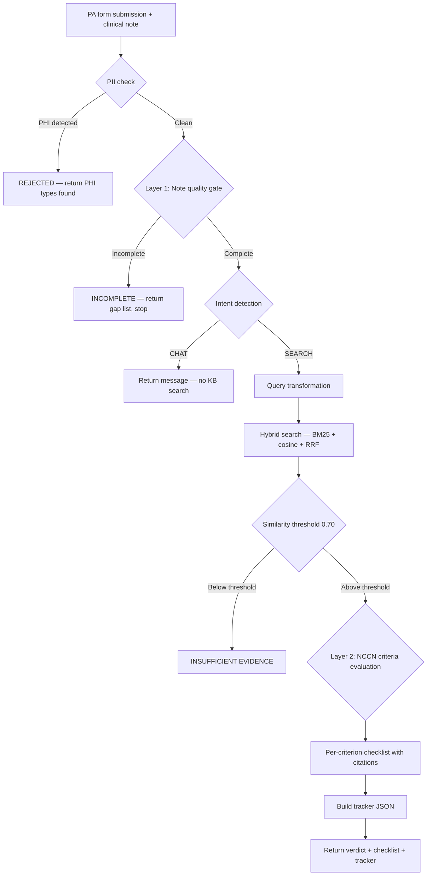
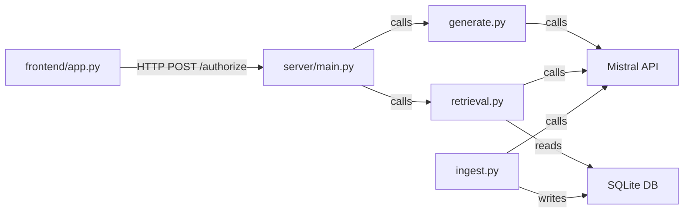
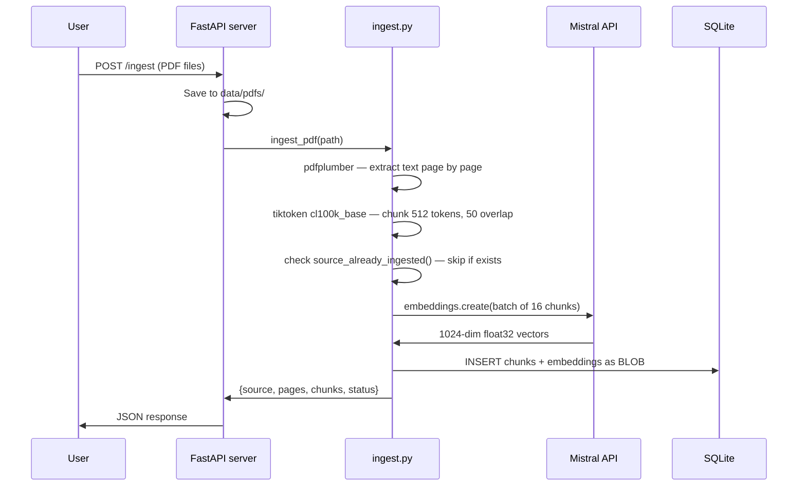
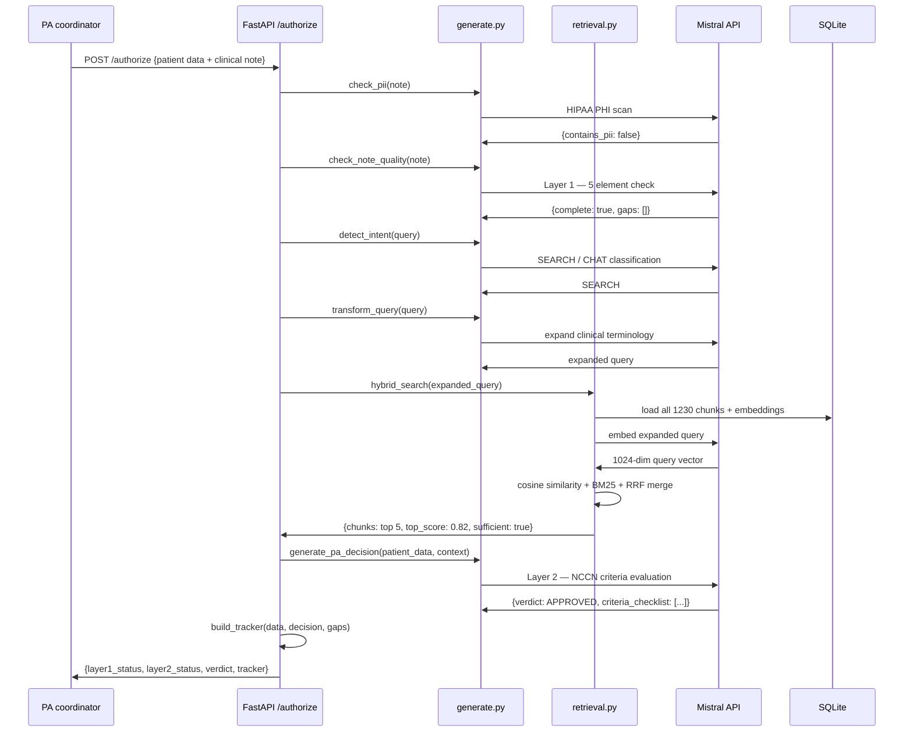

# 01 — System Architecture

## What this system is

The Oncology Prior Authorization RAG Pipeline is a two-layer
retrieval-augmented generation system. It is not a chatbot, not a
document search tool, and not a generic LLM wrapper. It is a
deterministic clinical decision support pipeline where a PA submission
goes in and a cited, criterion-by-criterion authorization verdict comes
out.

Every stage is explicit, auditable, and independently testable. The
two-layer design maps directly to the two ways PA submissions fail in
clinical practice — documentation failures and clinical criteria
failures — and addresses each with a separate mechanism.

---

## The two-layer pipeline

---

### Stage 1 — PII check

Runs before any external API call. The `check_pii()` function in
`generate.py` sends the first 2,000 characters of the clinical note
to Mistral with instructions to identify HIPAA-defined PHI categories:
patient full names, SSNs, MRNs, dates of birth, phone numbers, street
addresses, email addresses, and health plan beneficiary numbers.

**Why first:** Clinical notes submitted for PA review routinely contain
patient names and MRNs. If PII reaches the Mistral API without a
Business Associate Agreement, that is a HIPAA violation. The check
costs one API call but prevents a regulatory incident.

**Why LLM-based over regex:** Regex catches `\d{3}-\d{2}-\d{4}` for
SSNs in standard format. It misses "DOB March 15, 1964" or "patient
Smith" or "MRN: 987654" in a narrative note. The LLM identifies the
semantic content of the PHI, not just the pattern.

**Gap in current implementation:** LLM-based detection can have false
negatives for unusual PHI formats. A production deployment would add
Microsoft Presidio or AWS Comprehend Medical as a second layer and
log all refusals for audit with the PHI types detected.

---

### Stage 2 — Layer 1: Note quality gate

A single Mistral call checks the clinical note for five required
elements before any guideline retrieval begins:

1. ICD-10 diagnosis code
2. Biomarker results (PD-L1 TPS %, EGFR status, ALK status)
3. Line of therapy (first-line, second-line, etc.)
4. ECOG performance status (0-4)
5. Prior treatment history

**Why before retrieval:** Running Layer 2 NCCN evaluation on a note
that is missing ECOG PS or has "PD-L1 pending" is a wasted LLM call
that produces a misleading result. The two failure modes are different
problems — documentation failure and clinical criteria failure — and
must be caught separately.

**Implicit language handling:** The prompt instructs Mistral to extract
meaning, not match keywords. "Ambulates independently" implies ECOG
0-1. "Treatment-naive" implies prior therapy = none. "C34.12" is the
ICD-10 code. A keyword matcher fails on all three; the LLM reads them
correctly.

**Output format:** Structured JSON only — `{"complete": true/false,
"gaps": ["list of missing elements"], "summary": "one sentence"}`. If
complete is false, the pipeline returns the gap list immediately and
stops. No knowledge base access occurs.

---

### Stage 3 — Intent detection

A Mistral call classifies the query built from form data as SEARCH or
CHAT. If the PA form is submitted with only conversational input — or
if the system is being tested with "hello" — no knowledge base
operations run.

**Why separate from Layer 1:** Layer 1 checks note completeness. Intent
detection checks whether the query itself represents a clinical PA
request that warrants retrieval. They are different questions. A
complete note submitted with a conversational query still should not
trigger NCCN retrieval.

**Edge cases:** The classifier returns SEARCH if the word SEARCH appears
anywhere in the response — handles cases where the model adds
punctuation or wraps the word in formatting.

---

### Stage 4 — Query transformation

A Mistral call expands the query built from form fields with clinical
synonyms, brand and generic drug names, and expanded abbreviations.

**Why rewrite:** NCCN guidelines are written in formal clinical language.
The query "Pembrolizumab (Keytruda) 200mg IV Q3W Non-small cell lung
cancer PD-L1 60% 1L" benefits from expansion to include "programmed
death ligand 1 TPS >= 50 percent treatment naive first-line NSCLC
adenocarcinoma EGFR ALK negative KEYNOTE-024". The expanded query
produces better BM25 term matches and a more precisely located semantic
embedding.

**Example:**

| Original query | Transformed |
|---|---|
| Pembrolizumab NSCLC stage IIIA PD-L1 60% 1L EGFR negative | pembrolizumab Keytruda PD-1 inhibitor non-small cell lung cancer adenocarcinoma PD-L1 TPS >= 50% first-line treatment naive EGFR ALK ROS1 negative KEYNOTE-024 Category 1 |

---

### Stage 5 — Hybrid search

Two independent search algorithms run on the transformed query. Their
results are merged using Reciprocal Rank Fusion.

**Semantic search:** The query is embedded using `mistral-embed`. Cosine
similarity is computed between the query vector and every stored chunk
vector. The top results by similarity score are returned.

**BM25 keyword search:** The query is tokenised. Term frequency and
inverse document frequency scores are computed against every stored
chunk. The top results by BM25 score are returned.

**RRF merge:** Both ranked lists are combined using the formula
`1/(k + rank)` where k=60, summed across both lists. If the top
chunk's cosine similarity is below 0.70, the pipeline returns
"insufficient evidence" instead of proceeding to generation.

**Why both:** Semantic search captures meaning and paraphrase. "Keytruda
lung cancer" and "pembrolizumab NSCLC treatment" retrieve the same
chunks. BM25 catches exact clinical terms — "PD-L1 TPS >= 50%",
"EGFR exon 19 deletion", "KEYNOTE-024", "C34.12". Semantic search
blurs these precise thresholds; BM25 preserves them.

---

### Stage 6 — Layer 2: NCCN criteria evaluation

The top retrieved chunks are passed to Mistral alongside the patient
data as JSON. The PA_DECISION_PROMPT instructs the model to evaluate
each PA criterion against the retrieved guideline text and return a
structured verdict.

**Output format:** Per-criterion checklist with `met: true/false`,
`rationale`, and `source` with NCCN page number for every criterion.
Overall verdict: APPROVED or CRITERIA NOT MET. Evidence level: Category
1, Category 2A, etc. `appeal_recommended: true/false`.

**Grounded in retrieved text:** The model is instructed to evaluate
against the retrieved chunks, not its training data. NCCN v5.2026 is
dated March 2026 — after the model's training cutoff. Retrieved chunks
contain the current guideline text.

---

### Stage 7 — Tracker JSON

`build_tracker()` in `server/main.py` formats the complete PA decision
record as structured JSON. This mirrors the StackAI Generate Tracker
Entry agent output and is designed for downstream workflow integration.

Fields: patient_id (hashed), timestamp, agent, icd10, diagnosis, stage,
pdl1_tps, egfr, alk, ecog_ps, line_of_therapy, layer1_note_quality,
layer1_gaps, layer2_verdict, evidence_level, criteria_summary,
nccn_reference, appeal_recommended.

---

## Component responsibilities

| Component | Single responsibility |
|---|---|
| `server/main.py` | HTTP endpoints, request validation, response formatting, tracker assembly |
| `ingest.py` | PDF extraction, chunking, embedding, SQLite storage |
| `retrieval.py` | Cosine similarity, BM25, RRF, threshold check |
| `generate.py` | PII detection, intent detection, query transformation, Layer 1 prompt, Layer 2 prompt |
| `frontend/app.py` | Streamlit PA form, verdict display, criteria checklist, tracker JSON |

`server/main.py` is the only file that knows the full execution
sequence. It calls `check_pii`, `check_note_quality`, `detect_intent`,
`transform_query`, `hybrid_search`, `generate_pa_decision`, and
`build_tracker` in order. Each function does one thing and can be
tested or replaced independently.

---

## Data flow — ingestion

---

## Data flow — PA authorization

