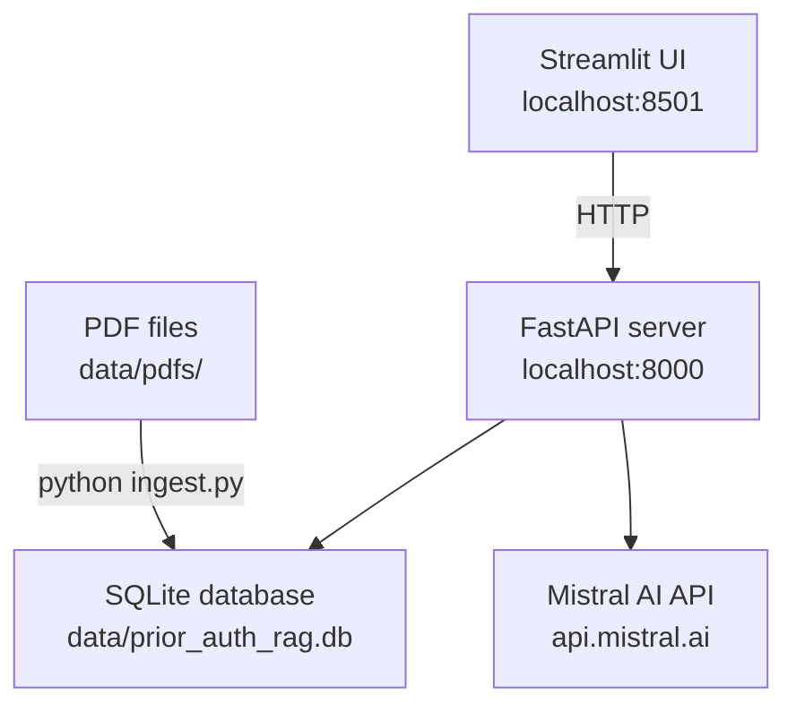
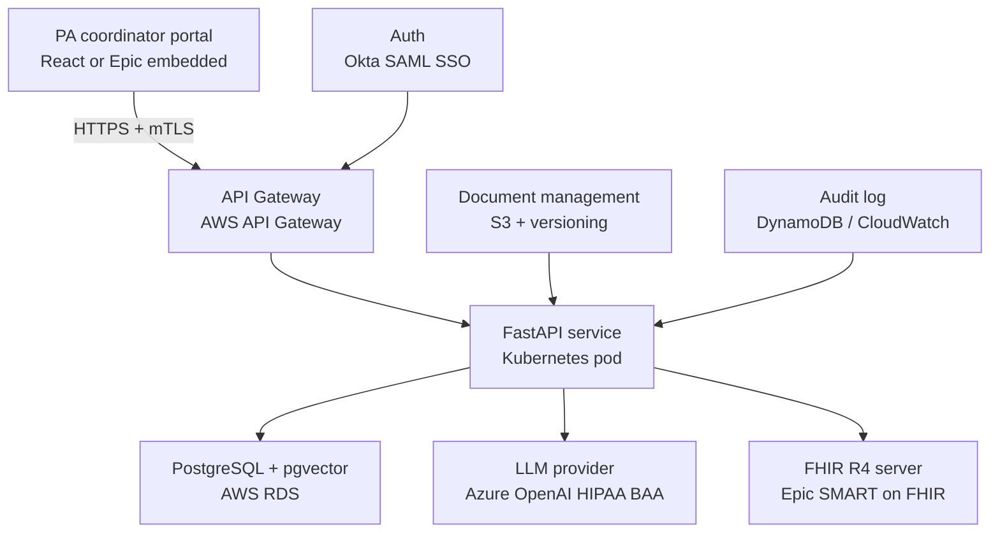
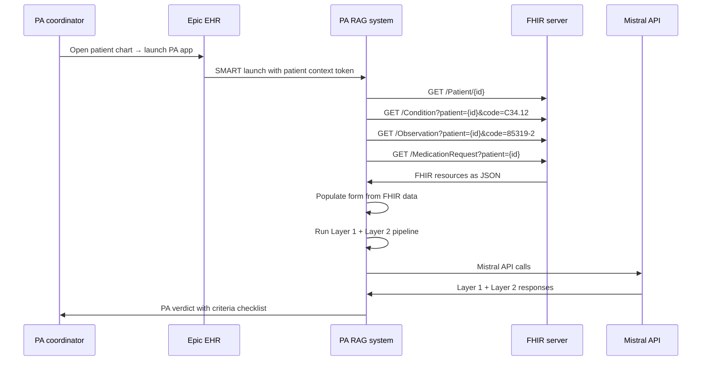

# 05 — Enterprise Architecture

## What this looks like at health system scale

The current implementation is a demo-grade system that proves the
architecture works. This document describes what the same architecture
looks like when deployed in a production oncology department — the
infrastructure changes, the integration points, and the compliance
requirements.

Nothing about the core pipeline changes. The retrieval logic, the
two-layer design, the prompt structure — all of these are production-
ready as designed. What changes is the surrounding infrastructure.

---

## Current architecture vs enterprise architecture

### Current (demo)



### Enterprise target



---

## The HIPAA question

The current system sends clinical note text to the Mistral API. If a
PA coordinator types a scenario containing a patient name and MRN —
which is routine in clinical workflows — that text is PHI under HIPAA.

**Current mitigation:** `check_pii()` runs before any data reaches
the Mistral API. Patient names, SSNs, MRNs, and dates of birth trigger
immediate rejection.

**Limitation:** LLM-based PII detection is not 100% reliable. Unusual
PHI formats may not be caught. More critically, the Mistral API itself
does not have a Business Associate Agreement for the free/developer
tier.

**Production requirement:** Either:

1. **BAA with LLM provider** — Mistral is available through the Azure
   marketplace with Azure's HIPAA BAA coverage. AWS Bedrock (Claude,
   Llama) and Google Vertex AI also offer HIPAA BAAs.

2. **Local LLM** — Run Llama 3.1 70B via Ollama on an on-premises GPU
   server. No PHI leaves the health system's infrastructure. Higher
   operational cost, eliminates vendor dependency.

3. **De-identification pipeline** — Strip PHI before any API call,
   operate on tokens, re-identify for display. "Patient John Smith,
   MRN 987654" → "[PATIENT_NAME], [MRN]". Requires a reliable
   de-identification model (AWS Comprehend Medical, Microsoft Presidio).

---

## The database at scale

### Current: SQLite + numpy in-memory search

Loading all 1,230 embeddings into memory per query works because:

- 1,230 chunks × 1024 dimensions × 4 bytes (float32) = 5.0 MB per query
- Single user demo — no concurrent write conflicts
- No geographic distribution required

**At scale:**

| Documents | Est. chunks | Memory per query | Status |
|---|---|---|---|
| 3 (current) | 1,230 | 5.0 MB | Acceptable |
| 10 | 4,000 | 16.4 MB | Acceptable |
| 50 | 20,000 | 82 MB | Acceptable |
| 500 | 200,000 | 820 MB | Borderline |
| All NCCN guidelines (50+) | 30,000+ | 123 MB | Upgrade needed |

### Production: PostgreSQL + pgvector

pgvector is a PostgreSQL extension that stores vectors natively and
supports approximate nearest neighbor (ANN) search using HNSW or
IVFFlat indexes.

**Schema change from SQLite:**

```sql
-- Current SQLite schema
CREATE TABLE chunks (
    id        INTEGER PRIMARY KEY AUTOINCREMENT,
    source    TEXT NOT NULL,
    page      INTEGER,
    chunk_idx INTEGER,
    text      TEXT NOT NULL,
    embedding BLOB NOT NULL          -- numpy bytes
);

-- pgvector schema
CREATE TABLE chunks (
    id        SERIAL PRIMARY KEY,
    source    TEXT NOT NULL,
    page      INTEGER,
    chunk_idx INTEGER,
    text      TEXT NOT NULL,
    embedding vector(1024),          -- native vector type
    version   TEXT,                  -- guideline version "v5.2026"
    is_current BOOLEAN DEFAULT true  -- false when superseded
);

CREATE INDEX ON chunks USING hnsw (embedding vector_cosine_ops);
```

**Query change:**

```sql
-- Replace numpy brute-force cosine with:
SELECT text, source, page,
       1 - (embedding <=> query_vector) AS similarity
FROM chunks
WHERE is_current = true
ORDER BY embedding <=> query_vector
LIMIT 5;
```

HNSW (Hierarchical Navigable Small World) provides approximate nearest
neighbor search — searching 200,000 vectors takes milliseconds instead
of seconds, at the cost of occasionally missing the true nearest
neighbor (typically < 2% recall loss at standard settings).

### Why not a dedicated vector database for oncology PA

Pinecone, Weaviate, Qdrant — these are purpose-built vector databases.
The reasons to prefer pgvector in a health system context:

**Data sovereignty:** PHI must stay in a system the health system
controls. Sending clinical notes to a third-party vector database adds
a vendor that needs a BAA and another attack surface.

**Operational familiarity:** Health system IT teams manage PostgreSQL.
They have runbooks, DBAs, and existing backup procedures. A novel
vector database is an operational burden.

**Capability:** For a guideline-based PA system with <500,000 chunks,
pgvector's HNSW index provides sub-10ms query times. Dedicated vector
databases add complexity without meaningful benefit at this scale.

---

## FHIR integration — the highest-value production enhancement

### What FHIR enables

The current system uses a manually-completed Streamlit form. In
production, every form field would be populated automatically from the
EHR via FHIR R4:

| Form field | FHIR resource | FHIR element |
|---|---|---|
| age | Patient | birthDate → calculate age |
| sex | Patient | gender |
| icd | Condition | code.coding[0].code |
| stage | Condition | stage.summary.text |
| pdl1 | Observation (LOINC 85319-2) | valueQuantity.value |
| egfr | Observation (LOINC 21717-5) | valueCodeableConcept |
| alk | Observation (LOINC 72286-7) | valueCodeableConcept |
| ecog | Observation (LOINC 89247-1) | valueInteger |
| agent | MedicationRequest | medicationCodeableConcept.coding[0].display |
| line | MedicationRequest | note.text |

**Why this matters:** Manual data entry is the most common source of
PA submission errors. A PA coordinator who miscopies the PD-L1 value
as 5.0% instead of 50% submits a request that fails Layer 2 at the
threshold check — not because the patient doesn't qualify, but because
of a transcription error. FHIR integration eliminates this error class.

### The SMART on FHIR authorization flow



### Current gap

`server/main.py` uses Pydantic model fields populated from the Streamlit
form. The FHIR integration would replace the form with a FHIR query
layer — `fhir.py` with `get_patient_demographics()`,
`get_active_conditions()`, `get_biomarker_results()`, and
`get_medication_requests()`. The pipeline itself does not change.

---

## Audit and compliance

Every AI-assisted PA decision in a regulated healthcare environment
must be auditable. The current system logs nothing beyond uvicorn
access logs.

### What an audit log must contain

```sql
CREATE TABLE pa_audit_log (
    id                UUID PRIMARY KEY DEFAULT gen_random_uuid(),
    timestamp         TIMESTAMPTZ NOT NULL DEFAULT NOW(),
    user_id           TEXT,           -- PA coordinator ID from SSO
    patient_id_hash   TEXT,           -- FHIR patient ID, hashed for privacy
    icd10             TEXT,           -- diagnosis code submitted
    agent             TEXT,           -- drug requested
    layer1_result     TEXT,           -- PASS / INCOMPLETE
    layer1_gaps       JSONB,          -- gap list if incomplete
    layer2_result     TEXT,           -- APPROVED / CRITERIA NOT MET
    evidence_level    TEXT,           -- Category 1, 2A, etc.
    top_score         FLOAT,          -- retrieval confidence
    sources_retrieved JSONB,          -- {source, page} for each chunk
    verdict_json      JSONB,          -- full Layer 2 output
    nccn_version      TEXT,           -- "v5.2026"
    model_version     TEXT,           -- "mistral-medium-latest"
    response_ms       INTEGER,        -- end-to-end latency
    pii_detected      BOOLEAN         -- was PII caught and rejected
);
```

This table answers:
- What did the system tell this coordinator about this patient?
- Was the verdict based on the current NCCN version?
- What was the retrieval confidence? Was the 0.70 threshold met?
- What specific pages were cited in the verdict?
- If the PA is later denied or appealed, what did the system recommend?

Under HIPAA, clinical AI decision support records require 6-year
retention. In a malpractice proceeding, this log demonstrates that the
AI recommendation was grounded in evidence, not hallucinated.

---

## Authentication and access control

The current system has no authentication. Anyone with the URL can
submit PA requests.

**Enterprise requirements:**
- SAML SSO via Okta or Azure AD — single sign-on with the health
  system's existing identity provider
- Role-based access control — PA coordinators submit requests;
  physicians review verdicts; administrators manage the knowledge base
- Session tokens with configurable expiry
- Audit log tied to authenticated user identity — every verdict is
  attributed to a specific user

---

## Document versioning

NCCN guidelines update multiple times per year. NCCN NSCLC v5.2026
supersedes v4.2026. Payer policies update quarterly. The current system
has no document versioning — a knowledge base update replaces all
existing chunks.

**Production requirement:**

When NCCN releases v6.2026:
1. New PDF is ingested with version tag "v6.2026"
2. Old chunks are marked `is_current = false`, not deleted
3. Queries run against `is_current = true` chunks by default
4. Historical queries can specify a version for retrospective audit
5. Every generated verdict includes the guideline version and date

This enables a PA coordinator to answer "what would the system have
recommended in January 2026?" — relevant when a payer questions whether
the correct guideline version was used at the time of submission.

---

## The five production gaps and their fixes

| Gap | Current state | Production fix |
|---|---|---|
| In-memory search | numpy brute force, 5MB per query | pgvector HNSW index, <10ms at 200K chunks |
| No FHIR integration | Manual Streamlit form | SMART on FHIR, Epic API |
| No authentication | Open URL | SAML SSO + RBAC |
| No audit trail | No logging | Structured audit log table with 6-year retention |
| LLM API without BAA | Mistral developer tier | Azure OpenAI HIPAA BAA or local Llama |

None of these gaps affect the correctness of the pipeline for demo
purposes. All five must be addressed before any deployment handling
real patient data. The architecture supports all five fixes without
changing the core Layer 1 / Layer 2 logic.


## Current deployment — Hugging Face Spaces

The system is currently deployed on Hugging Face Spaces (Docker SDK),
CPU Basic tier. This is the live portfolio deployment.

**URL:** https://huggingface.co/spaces/RaagaLikhitha/prior-auth-rag

**Why HF Spaces over Railway or Render:**

| Property | HF Spaces | Railway | Render |
|---|---|---|---|
| Cost | Free forever | $5/month after trial | Free tier available |
| Sleeps when idle | No | No | Yes (15 min) |
| Binary file support | Via Git LFS / Xet | Yes | Yes |
| Custom Docker | Yes | Yes | Yes |
| HTTPS | Yes (automatic) | Yes | Yes |
| Persistent storage | Container filesystem | Ephemeral on free | Persistent disk ($7/mo) |

HF Spaces CPU Basic provides 2 vCPU and 16GB RAM — sufficient for the
1,230-chunk SQLite database and 5 concurrent Mistral API calls. The
container filesystem persists across restarts, so the database built
on first boot survives container restarts without re-ingestion.

**Startup sequence on HF Spaces:**

`start.sh` is the Docker entrypoint. On container start:

1. Creates `data/pdfs/` directory if it does not exist
2. Checks if `data/prior_auth_rag.db` exists — skips ingest if it does
3. Downloads Cigna Drug Coverage Policy 1403 PDF from public URL
4. Runs `python ingest.py` — builds SQLite database (91 chunks, ~30 seconds)
5. Starts `uvicorn server.main:app --host 0.0.0.0 --port 8000`
6. Waits 5 seconds for FastAPI to be ready
7. Starts `streamlit run frontend/app.py --server.port 7860`

**The five production gaps still apply** — HIPAA BAA, FHIR integration,
pgvector, audit trail, authentication — none of these are addressed by
the HF Spaces deployment. HF Spaces is a portfolio demonstration, not
a HIPAA-compliant production deployment. The architecture supports all
five production upgrades without changing the core pipeline logic.
