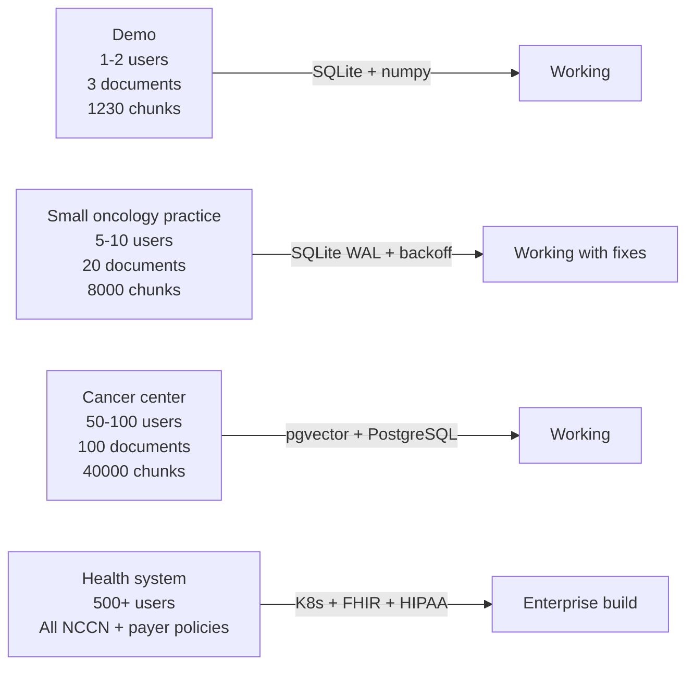

# 06 — Failure Modes and Scaling

## How to think about failure in a clinical AI system

A clinical AI system has two categories of failure:

**Silent failure** — the system returns a wrong verdict confidently.
This is the dangerous category. An APPROVED verdict for an EGFR-positive
patient who should receive osimertinib, not pembrolizumab. A cited
PD-L1 threshold that references the wrong KEYNOTE trial. A fabricated
NCCN page number that does not exist. These can influence clinical
decisions and PA submissions.

**Loud failure** — the system crashes, returns an error, or explicitly
refuses to answer. This is the safe category. A system that goes down
is annoying. A system that confidently generates a wrong PA approval
is dangerous.

Every design decision in this pipeline prioritises loud failure over
silent failure. The 0.70 threshold, the Layer 1 gate, the insufficient
evidence response — all of these are mechanisms to convert potential
silent failures into loud ones.

---

## Known failure modes — ranked by severity

### Severity 1 — Silent clinical error (most dangerous)

**Failure:** The system retrieves plausible but wrong chunks and
generates a fluent, cited, incorrect verdict.

**Example:** A query about pembrolizumab in NSCLC retrieves a chunk
about pembrolizumab in melanoma (cosmetic similarity: both are PD-1
inhibitors). The generated verdict states a threshold that applies to
melanoma, not NSCLC. The PA is submitted with a fabricated clinical
basis.

**Current mitigation:** The 0.70 similarity threshold reduces this risk
for grossly wrong retrievals. The structured JSON output forces per-
criterion reasoning that makes individual errors visible. But if a
wrong chunk scores above 0.70 — possible when two indications share
similar clinical language — the threshold check will not catch it.

**Production fix:**
- Curated test set of PA scenarios with verified correct verdicts
- Automated retrieval evaluation (MRR, NDCG@5) run on every code change
- Human expert review of verdicts below a secondary confidence threshold

**Why this matters:** This is the only failure mode that could cause
patient harm if a coordinator acts on the verdict without independent
physician review. The system is decision support, not a replacement for
clinical judgment.

---

### Severity 2 — Rate limit exhaustion (service outage)

**Failure:** The Mistral API returns 429 Too Many Requests during a
burst of PA submissions. Multiple API calls per request (PII check,
Layer 1, intent detection, query transform, embedding, Layer 2)
multiply the rate limit exposure.

**Current mitigation:** Exponential backoff in `ingest.py` for embedding
calls. No retry logic in `generate.py` for generation calls — a 429
during Layer 2 raises an unhandled exception and the request fails.

**Observed behaviour:** During rapid testing with multiple simultaneous
submissions, the endpoint returns 500 errors when Mistral rate limits
fire during generation.

**Production fix:**
- Paid Mistral tier — eliminates rate limits
- Retry with backoff in `generate.py` matching the pattern in `ingest.py`
- Queue-based processing — queue PA requests and process asynchronously
  rather than blocking the HTTP request
- Circuit breaker — if 3 consecutive requests fail, reject new requests
  for 60 seconds rather than retrying endlessly

---

### Severity 3 — In-memory search OOM (scalability ceiling)

**Failure:** At >200,000 chunks, loading all embeddings into memory per
query exceeds available RAM and the process is killed.

**Current state:** 1,230 chunks = 5.0 MB. Acceptable on any server.

**Ceiling:** ~50,000 chunks before memory pressure becomes noticeable
on a 512MB deployment.

**Projection:** Adding all 50+ NCCN cancer-specific guidelines would
produce ~30,000 chunks — approaching the ceiling for a small server.
Adding all major payer policies would add another ~20,000 chunks.

**Production fix:** pgvector HNSW index — O(log n) approximate nearest
neighbor search instead of O(n) exhaustive cosine comparison. Query
time stays constant regardless of knowledge base size.

---

### Severity 4 — SQLite concurrency (data corruption risk)

**Failure:** Two PA coordinators submit requests simultaneously. Each
triggers Layer 1 and Layer 2, but Layer 2 for both requests loads
chunks from SQLite at the same time. SQLite handles concurrent readers
but only one writer at a time. If a document is being ingested via
`POST /ingest` while a query is running, the database may be locked.

**Current mitigation:** Single-user demo — concurrent access is
unlikely. WAL mode provides some protection:

```python
conn.execute("PRAGMA journal_mode=WAL")
```

WAL (Write-Ahead Logging) allows concurrent reads during writes but
does not fully solve high-concurrency write scenarios.

**Production fix:** PostgreSQL with MVCC (Multi-Version Concurrency
Control) — designed for concurrent access with proper isolation.

---

### Severity 5 — BM25 full corpus rebuild (query performance)

**Failure:** On every `/authorize` request, `bm25_search()` computes
term frequencies and IDF scores across all 1,230 chunks. For 1,230
chunks this is fast (<50ms). For 200,000 chunks this becomes the query
bottleneck — 2-5 seconds per request.

**Current state:** Acceptable at 1,230 chunks. Will degrade linearly
as the knowledge base grows.

**Production fix:** Build and cache the BM25 index at server startup:

```python
@app.on_event("startup")
async def startup():
    app.state.chunks = load_all_chunks()
    app.state.bm25_corpus = [tokenize(c["text"]) for c in app.state.chunks]
    app.state.bm25_df = build_document_frequencies(app.state.bm25_corpus)
```

Invalidate the cache only when `/ingest` succeeds. This converts an
O(n) per-query operation to an O(1) per-query lookup with O(n)
amortised cost paid only on ingestion.

---

### Severity 6 — No input length validation (cost amplification)

**Failure:** A user pastes a 50,000-character clinical note into the
note field. The PII check sends 2,000 characters (truncated). Layer 1
sends the full note — 50,000 characters × ~1.3 tokens/character = ~65,000
tokens. This exceeds Mistral's context window and the call fails with
a context length error.

**Current state:** No validation on note length.

**Production fix:**

```python
class PARequest(BaseModel):
    note: Optional[str] = ""

    @validator('note')
    def note_length(cls, v):
        if v and len(v) > 5000:
            raise ValueError('Clinical note must be under 5000 characters')
        return v.strip()
```

5,000 characters is approximately 1,200-1,500 tokens — sufficient for
a complete oncology consultation note and well within the Mistral
context window.

---

### Severity 7 — No rate limiting on API endpoints (abuse)

**Failure:** Anyone with the server URL can send unlimited requests,
burning through the Mistral API key budget. At $0.015 per request,
1,000 automated requests costs $15 and can exhaust a free-tier API
key.

**Current state:** No rate limiting.

**Production fix:**

```python
from slowapi import Limiter
from slowapi.util import get_remote_address

limiter = Limiter(key_func=get_remote_address)

@app.post("/authorize")
@limiter.limit("10/minute")
async def authorize(request: Request, req: PARequest):
    ...
```

10 PA requests per minute per IP is sufficient for clinical use — a
PA coordinator submitting requests in real-time does not need more
than one per 6 seconds.

---

## Scaling summary



The core pipeline — two-layer evaluation, hybrid search, structured
verdict — does not change at any scale. What changes is the surrounding
infrastructure: database, caching, deployment, authentication, audit
trail.

This is the correct way to think about the system: production-ready
in architecture, demo-grade in infrastructure. The path from demo to
enterprise is a series of independent infrastructure upgrades, not a
rewrite of the clinical decision logic.
